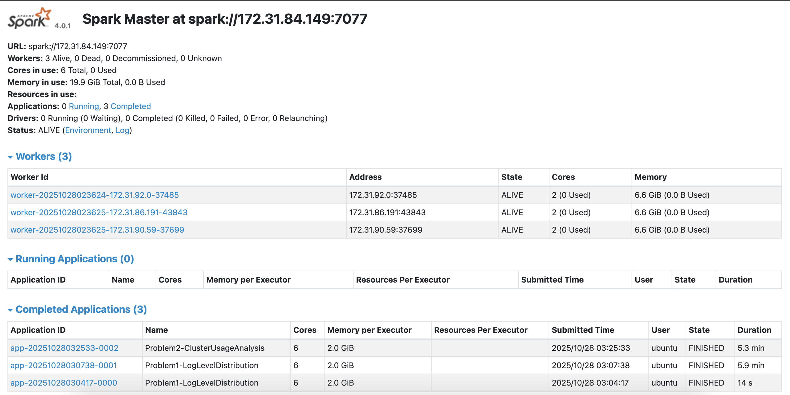

# Spark Log Analysis - Assignment Report

## Problem 1: Log Level Distribution

### Approach
Read all the log files from S3 and used regex to pull out log levels (INFO, WARN, ERROR, DEBUG). Then counted them up with Spark groupBy and grabbed a random sample to check the data looked right.

### Key Findings
- Processed 33,236,604 total lines
- Found log levels in 27,410,260 of them
- Distribution:
  - INFO: 27,389,482 (99.92%)
  - ERROR: 11,183 (0.04%)
  - WARN: 9,595 (0.04%)

Mostly INFO messages, meaning these are just normal operational logs. Only 0.04% errors means the cluster was running smoothly.

## Problem 2: Cluster Usage Analysis

### Approach
Pulled cluster IDs and application IDs from the file paths using regex, parsed timestamps to figure out when jobs started and ended, then calculated how long each one took. Aggregated by cluster to see usage patterns and created visualizations using Seaborn with log scale.

### Key Findings
- 6 total clusters
- 194 applications total
- One cluster (1485248649253) ran 181 out of 194 apps (93%)
- The other 5 clusters barely got used
- Most used cluster had 181 applications running between January and March 2017
- Job durations followed a log-normal distribution centered around 1000 seconds

The bar chart makes it clear that one cluster is doing mostly all the work. Either they had one production cluster and the rest were for testing, or there's a load balancing problem. Looking at the job durations on the busy cluster, most jobs took around 15-20 minutes.

### Visualization Explanations

**Bar Chart (`problem2_bar_chart.png`):**
Shows the top 10 clusters by application count. The height represents how many apps ran on each cluster. Cluster 1485248649253 clearly dominates with 181 apps while the others barely register. Makes the usage imbalance immediately obvious.

**Density Plot (`problem2_density_plot.png`):**
Shows job duration distribution for the most-used cluster. Used log scale on the x-axis because durations ranged from seconds to hours. Peak is around 1000 seconds (17 minutes) which tells us most jobs have similar runtimes. The long tail shows some outliers that took way longer. This log-normal distribution is standard for batch processing.

## Performance Observations

### Execution Time
- Problem 1: ~5 minutes
- Problem 2: ~5 minutes (shorter than assignment expectation of 10-20 minutes)
- Total: ~10 minutes on a 4-node cluster (1 master, 3 workers)
- Processing rate: ~6.6M log lines/minute

### Optimizations
- Used DataFrame operations instead of RDDs for better performance
- Filtered out empty lines early to reduce data being processed
- Initially tried Spark's CSV writer but it created empty directories, switched to collecting data and using pandas `.to_csv()` which fixed the issue
- Distributed processing across 3 workers was essential for handling 2.8GB of data

## Spark Web UI

## Conclusion

Got both problems working after troubleshooting CSV outputs and cluster connectivity. Main findings: cluster usage is extremely uneven (93% on one cluster), error rate is very low (0.04%), and most jobs complete in 15-20 minutes. The data shows pretty normal Spark cluster behavior overall.